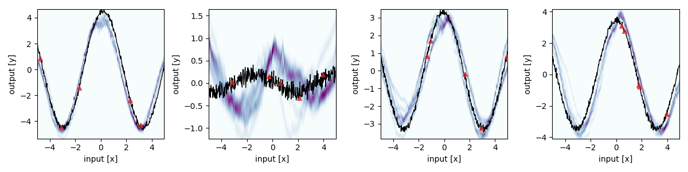

# MAML Algorithms for Meta Learning

## What is this ?
This is a package to quickly run the following Meta-Learning algorithms:
- MAML 
- PLATIPUS
- BMAML
- CLV
- Baseline (classical supervised learning)


## Getting Started
1. (Optional) create and activate a conda environment
    ```
    conda create --name meta_learning
    conda activate meta_learning
    conda install pip
    ```
2. clone this repository and run 
    ```
    pip install .
    ```
    from the source directory

# Usage
## run in vscode
We defined some default scenarios in the `.vscode/launch.json` you can simply run if you open the project in vscode.
- QuickRun
- Full Run (might take some hours depending on your machine)
- Adaptation Sanity Check
- Meta-Update Sanity Check

## import into another project
Install this package in your own project using pip
```
pip install git+https://github.com/LuisAugenstein/Bayesian-Meta-Learning
```
Then import the Learner into your script
```
from bayesian_meta_learning import Learner

config = Learner.get_default_config()
config['algorithm'] = 'maml'
config['benchmark'] = 'Sinusoid1D'
config['num_epochs'] = 10
config['num_test_tasks'] = 4
config['minibatch'] = 4

Learner.run(config)
```

## Comparison Runs

The runs we compare in the final report were created using the script `slurm/comparison_run.sh`.

This script requires a `slurm` Workload Manager to be installed.
Make sure to change to the appropriate Conda environment before starting the jobs.

At the time of testing, all jobs were run on CPU.
To change to GPU execution, go to `slurm/start_job.sh` and change the required resources to GPU. If installed correctly, the GPU should be recognized automatically, so no further changes are necessary.

To start the full comparison, run:
```
sh slurm/comparison_run.sh
```

Starting the full comparison requires significant compute power.
With the current configuration, you can expect around 2000 CPU hours.


## Acknowledgement

This implementation depends heavily on [few_shot_meta_learning](https://github.com/cnguyen10/few_shot_meta_learning).
If you do not need our comparison suite and only need to train meta learning algorithms, this repository might be more suitable.


